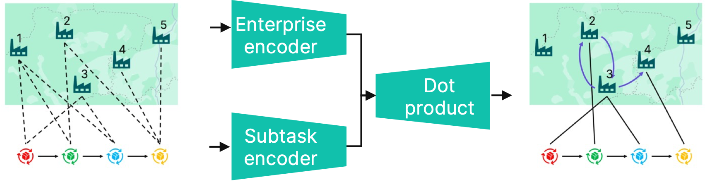

# Heterogeneous Graph Attention Networks for Scheduling in Cloud Manufacturing and Logistics

This repository is the official implementation of methods from the paper Graph Attention Networks for Scheduling in Cloud Manufacturing and Logistics.

We investigate task scheduling in cloud manufacturing systems, emphasizing logistics integration. We propose a novel Graph Neural Network architecture for optimizing task scheduling by representing the problem on a heterogeneous graph, where nodes denote tasks and locations.



An example of the problem graph (left) and the solution graph (right). The lower subgraph represents 4 subtasks to be scheduled. Dotted edges between subgraphs in the problem graph show available enterprises to perform operations. Solid edges in the solution graph show assigned enterprises. The encoder generates feature embeddings, the dot product decoder predicts a probability of possible assignments.

## Requirements

To install dependencies, run 
```
pip install -r requirements.txt
```

## Running experiments

To run experiments on the baselines and the GNN model, run the following command:

```
python main.py
```

The results will be stored in the `results.log` file.

To train the GNN models from scratch, run the following command:

```
python train.py
```

The results will be stored in the `training_gnn` folder.

## Experimental results

The total cost (the lower the better) of solutions to the problems in the [LMSC dataset](https://figshare.com/articles/dataset/DataSet_for_logistics_and_manufacturing_service_composition/14229299?file=26849792).

| Tasks-Operations-<br>Enterprises | No. | Optimal<br>solution | Random<br>solution | Greedy<br>algorithm | Genetic<br>algorithm | GNN (Ours) |
|----------------------------------|-----|---------------------|--------------------|---------------------|----------------------|------------|
| 5-5-5                            | 1   | 2648.63             | 3484.19            | 3495.44             | 2648.63              | 2780.38    |
|                                  | 2   | 5944.42             | 8704.79            | 8266.23             | 5944.42              | 5944.42    |
|                                  | 3   | 6653.88             | 8896.25            | 8868.77             | 6653.88              | 6653.88    |
| 5-10-10                          | 1   | 5086.08             | 12599.87           | 6325.05             | 5145.03              | 5141.23    |
|                                  | 2   | 7352.66             | 18310.91           | 10974.05            | 7409.04              | 7352.66    |
|                                  | 3   | 7652.32             | 19556.74           | 12521.69            | 7714.85              | 7652.32    |
| 10-10-10                         | 1   | 12221.76            | 33980.4            | 14849.09            | 12656.17             | 15306.85   |
|                                  | 2   | 14275.53            | 39574.01           | 21835.97            | 14322.24             | 14275.53   |
|                                  | 3   | 14200.75            | 40062.74           | 23082.48            | 14303.49             | 14200.75   |
| 5-10-20                          | 1   | 4252.04             | 11542.44           | 6091.69             | 4289.83              | 4701.41    |
|                                  | 2   | 5497.29             | 18336.67           | 9377.16             | 5543.21              | 5497.29    |
|                                  | 3   | 5866.18             | 20916.08           | 9414.35             | 5925.18              | 5866.18    |
| 5-20-10                          | 1   | 13512.96            | 36326.45           | 15446.19            | 13805.60             | 13921.15   |
|                                  | 2   | 15803.26            | 42108.59           | 19195.71            | 16137.08             | 16116.05   |
|                                  | 3   | 16703.56            | 45502.72           | 20396.13            | 17243.44             | 17491.83   |
| 5-20-20                          | 1   | 11392.82            | 34663.67           | 14002.05            | 11875.55             | 13500.28   |
|                                  | 2   | 13045.16            | 42312.09           | 17038.35            | 13580.50             | 14550.33   |
|                                  | 3   | 14366.02            | 45445.61           | 18597.85            | 14899.99             | 16083.00   |

Please note that results may differ slightly from the paper due to randomness.
